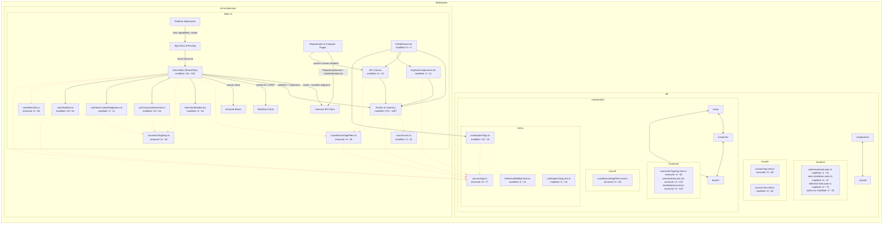

```mermaid
flowchart LR
%% tld-scene repo=1 key=7f426686d96ec1311ff72096138447acf19f8c72c3ae88b4fb57cb940dd2e602
%% impact files=51 added=389 removed=2313 complete=true basis=net_tree binary=0 affected=27 neighbours=0 authored=6 containers=9 radius=0

subgraph view_1["Workspace"]

  subgraph view_2["tld"]
    el_2_502["vscode"]
    el_2_2["components"]

    subgraph view_3["components"]
      el_3_61["menu"]
      el_3_97["connector"]
      el_3_138["branch"]

      subgraph view_12["menu"]
        el_12_neg1766928001["SelectionBulkBar.test.tsx<br/>modified +0 −14"]
        el_12_neg573557422["useExploreTags.test.ts<br/>modified +1 −19"]
        el_12_neg200179319["useExploreTags.ts<br/>modified +19 −16"]
        el_12_neg200179319--xel_55_neg85617149
      end

      subgraph view_13["connector"]
        view_13_isolated["connectorTagDrop.test.ts removed +0 −64<br/>useViewData.test.tsx removed +0 −125<br/>nestSelection.test.ts removed +0 −120"]
      end

      subgraph view_15["branch"]
        el_15_neg1114702830["crossBranch/tagFilters.test.ts<br/>removed +0 −29"]
      end
      el_3_61 <--> el_3_97
      el_3_97 <--> el_3_138
      el_3_61 <--> el_3_138
    end

    subgraph view_31["frontend"]
      view_31_isolated["node-keyboard.spec.ts modified +1 −51<br/>view-markdown.spec.ts modified +0 −37<br/>selection-bulk.spec.ts modified +0 −73<br/>index.css modified +2 −33"]
    end

    subgraph view_35["vscode"]
      el_35_neg1541454064["canvasTags.test.ts<br/>removed +0 −59"]
      el_35_neg6717197["sourceLinks.test.ts<br/>modified +0 −20"]
    end
    el_2_2 <--> el_2_502
  end

  subgraph view_54["tld Architecture"]

    subgraph view_55["Web UI"]
      el_55_602["Connect API Client"]
      el_55_605["App Entry &amp; Routing"]
      el_55_634["Panels &amp; Inventory<br/>modified +274 −1087"]
      el_55_635["Platform Abstraction"]
      el_55_636["Realtime Client"]
      el_55_640["Repositories &amp; Compare Pages"]
      el_55_644["Zustand Stores"]
      el_55_647["View Editor (ReactFlow)<br/>modified +26 −148"]
      el_55_659["ZUI Canvas<br/>modified +4 −10"]
      el_55_neg385765884["crossBranch/tagFilters.ts<br/>removed +0 −28"]
      el_55_neg1220139190["InfiniteZoom.tsx<br/>modified +0 −3"]
      el_55_neg1405137189["SelectionBulkBar.tsx<br/>modified +0 −24"]
      el_55_neg1514470676["connectorTagDrop.ts<br/>removed +0 −30"]
      el_55_neg78622637["useCanvasInteractions.ts<br/>modified +23 −64"]
      el_55_neg1252245082["useViewContextNeighbours.ts<br/>modified +2 −11"]
      el_55_neg1120080532["useViewData.ts<br/>modified +39 −61"]
      el_55_neg940606553["nestSelection.ts<br/>removed +0 −94"]
      el_55_neg346687834["ExploreComponents.tsx<br/>modified +2 −11"]
      el_55_neg85617149["canvasTags.ts<br/>removed +0 −77"]
      el_55_neg771657448["sourceLinks.ts<br/>modified +0 −15"]
      el_55_605 -- "route /views/:id" --> el_55_647
      el_55_635 -- "host capabilities, routes" --> el_55_605
      el_55_640 -- "RepositoryService / CodeIndexService" --> el_55_602
      el_55_640 -- "custom canvas renderer" --> el_55_659
      el_55_647 -- "loads + mutates diagrams" --> el_55_602
      el_55_647 -- "sidebars + inspectors" --> el_55_634
      el_55_647 -- "presence / CRDT" --> el_55_636
      el_55_647 -- "canvas store" --> el_55_644
      el_55_634 --> el_55_neg771657448
      el_55_634--xel_55_neg85617149
      el_55_659 --> el_55_634
      el_55_634--xel_55_neg385765884
      el_55_659--xel_55_neg385765884
      el_55_neg385765884--xel_55_neg85617149
      el_55_neg1220139190 --> el_55_634
      el_55_neg1220139190 --> el_55_659
      el_55_neg1220139190 --> el_55_neg346687834
      el_55_neg1220139190 --> el_12_neg200179319
      el_55_neg78622637--xel_55_neg1514470676
      el_55_neg1120080532--xel_55_neg1514470676
      el_55_neg1120080532--xel_55_neg85617149
      el_55_647--xel_55_neg385765884
      el_55_647 --> el_55_neg1405137189
      el_55_647--xel_55_neg1514470676
      el_55_647 --> el_55_neg78622637
      el_55_647 --> el_55_neg1252245082
      el_55_647 --> el_55_neg1120080532
      el_55_647--xel_55_neg940606553
      el_55_647--xel_55_neg85617149
      el_55_neg346687834 --> el_55_634
      el_55_neg346687834--xel_55_neg85617149
    end
  end
end

linkStyle 0 stroke:#fc8181,stroke-dasharray:5 5
linkStyle 13 stroke:#ecc94b
linkStyle 14 stroke:#fc8181,stroke-dasharray:5 5
linkStyle 16 stroke:#fc8181,stroke-dasharray:5 5
linkStyle 17 stroke:#fc8181,stroke-dasharray:5 5
linkStyle 18 stroke:#fc8181,stroke-dasharray:5 5
linkStyle 23 stroke:#fc8181,stroke-dasharray:5 5
linkStyle 24 stroke:#fc8181,stroke-dasharray:5 5
linkStyle 25 stroke:#fc8181,stroke-dasharray:5 5
linkStyle 26 stroke:#fc8181,stroke-dasharray:5 5
linkStyle 28 stroke:#fc8181,stroke-dasharray:5 5
linkStyle 32 stroke:#fc8181,stroke-dasharray:5 5
linkStyle 33 stroke:#fc8181,stroke-dasharray:5 5
linkStyle 35 stroke:#fc8181,stroke-dasharray:5 5
```
